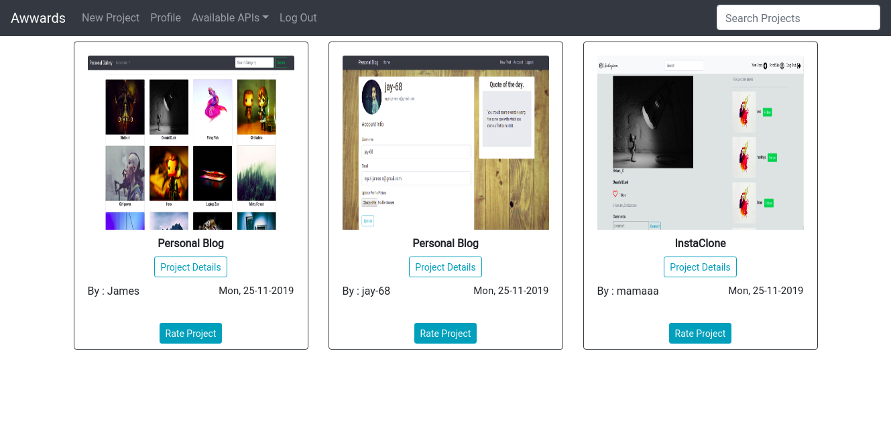

# Awwards

#### Author **[James N.](https://github.com/jay-68)**

# Description  
This project allows users to post their projects for other users to rate according to design, usability and content 
##  Live Link 

 Click [View Site](https://awwards68.herokuapp.com)  to visit the site
  

## User Story  
  
* A user can view posted projects and their details.  
* A user can post a project to be rated/reviewed. 
* A user can rate/ review other users' projects.  
* Search for projects.  
* View projects overall score.
* A user can view their profile page.

##### Cloning the repository:  
```bash
https://github.com/Jay-68/awwards
```
##### Navigate into the folder and install requirements  
 ```bash
 cd Project-voter pip install -r requirements.txt 
 ```
##### Install and activate Virtual  
```bash
- python3 -m venv virtual - source virtual/bin/activate
```
##### Install Dependencies  
```bash
 pip install -r requirements.txt 
``` 
 ##### Setup Database  
  SetUp your database User,Password, Host then make migrate  
 ```bash 
python manage.py makemigrations voter
 ``` 
 Now Migrate

```bash
python manage.py migrate 
```
##### Run the application  
```bash
python manage.py runserver 
```
##### Testing the application  
```bash
 python manage.py test 
```
Open the application on your browser `127.0.0.1:8000`.  


## Technology used  
  
* [Python3.6](https://www.python.org/)  
* [Django 1.11](https://docs.djangoproject.com/en/2.2/)  
* [Heroku](https://heroku.com)
* HTML
* Bootstrap 4
* Postgresql

## Support and contact details
Contact me on ngari.james.n@gmail.com  for any comments, reviews or collaboration.

### License
MIT - Licence